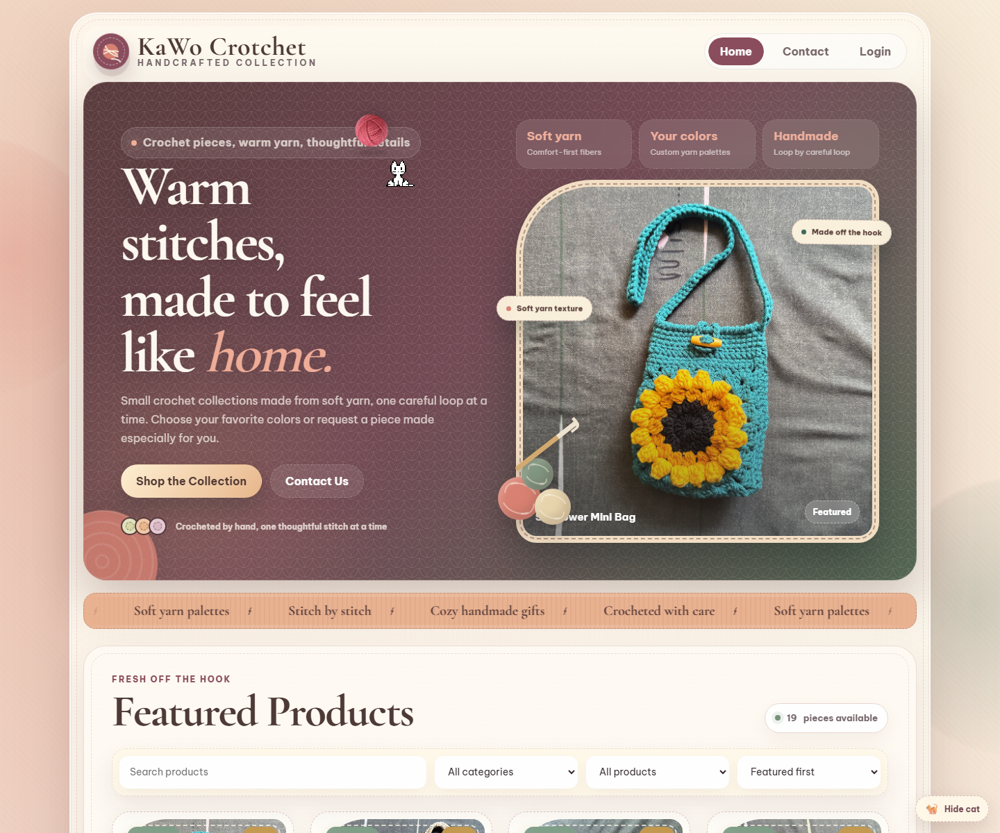
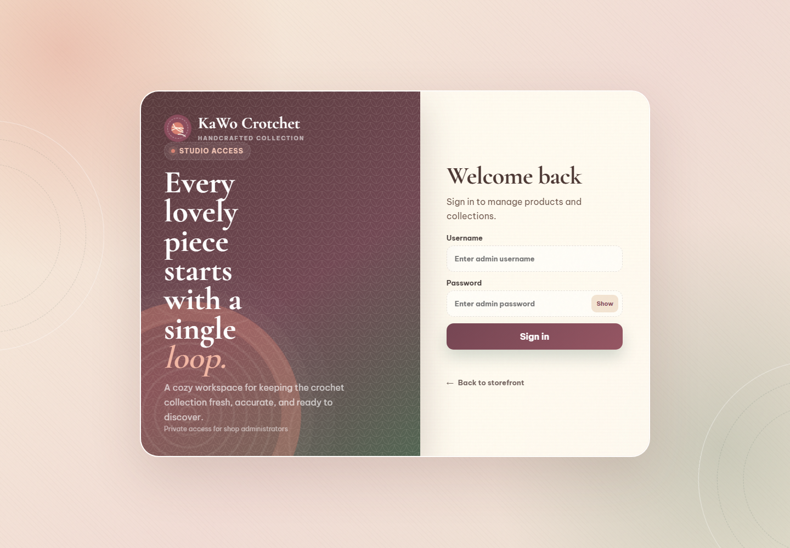

# KaWo Crotchet Shop Website

<div align="center">
  
  <h3>Handcrafted crochet storefront with admin product management</h3>
  <p>
    Built with Express, MongoDB Atlas, Amazon S3, Docker, and GitHub Actions deployment to AWS EC2.
  </p>
  <p>
    <a href="https://kawocrotchet.site/">Live Website</a>
    |
    <a href="#screenshots">Screenshots</a>
    |
    <a href="#features">Features</a>
    |
    <a href="#api">API</a>
    |
    <a href="#deployment">Deployment</a>
  </p>
</div>



## Overview

KaWo Crotchet is a full-stack shop website for a handmade crochet brand. It combines a polished static storefront with an Express backend for product data, admin authentication, catalog management, media uploads, SEO routes, and production deployment.

The app is deployed as one runtime today, while the code is organized into service boundaries so it can evolve cleanly as the project grows.

## Screenshots

The images below were captured from the live production website at [kawocrotchet.site](https://kawocrotchet.site/).

| Storefront | Admin access |
| --- | --- |
|  |  |

## Features

- Public storefront with featured products, categories, search, filters, sorting, stock state, and product detail pages
- JWT-protected admin workflow for creating, editing, publishing, featuring, and deleting products
- Product image upload and lifecycle management through Amazon S3
- MongoDB Atlas catalog storage with Mongoose models and validation
- SEO support for sitemap, robots.txt, canonical product URLs, and social preview metadata
- Dockerized production runtime with health and readiness endpoints
- GitHub Actions deployment pipeline to AWS EC2 through Amazon ECR and Systems Manager

## Tech Stack

| Layer | Tools |
| --- | --- |
| Frontend | HTML, CSS, vanilla JavaScript |
| Backend | Node.js, Express 5 |
| Database | MongoDB Atlas, Mongoose |
| Auth | JSON Web Tokens |
| Media | Amazon S3, Multer |
| Deployment | Docker, Amazon ECR, AWS EC2, AWS SSM, GitHub Actions |

## Architecture

```text
src/
  gateway/             Express app, static frontend, shared middleware
  services/
    auth/              Admin login and token issuing
    catalog/           Product model, validation, mapping, routes, queries
    media/             Upload middleware and S3 image handling
    seo/               Sitemap, robots.txt, SEO routes
  shared/
    auth/              JWT admin middleware
    config/            Environment loading and validation
    db/                MongoDB connection
    http/              Async and error helpers
```

## API

Public catalog:

- `GET /products`
- `GET /products/meta/categories`
- `GET /products/:identifier`

Admin:

- `POST /admin/login`
- `GET /admin/products`
- `POST /admin/add-product`
- `PUT /admin/products/:id`
- `DELETE /admin/products/:id`

Operational:

- `GET /health`
- `GET /ready`

## Local Setup

1. Copy `.env.example` to `.env`
2. Fill in MongoDB Atlas, S3, admin credentials, and JWT secret
3. Install dependencies:

```bash
npm install
```

4. Run locally:

```bash
npm run dev
```

5. Open `http://localhost:3000`

Run a lightweight JavaScript syntax check before pushing:

```bash
npm run check
```

## Environment Variables

| Variable | Purpose |
| --- | --- |
| `MONGODB_URI` | MongoDB Atlas connection string |
| `SITE_URL` | Public website URL for sitemap, robots.txt, and canonical links |
| `JWT_SECRET` | Token signing secret |
| `ADMIN_USERNAME` | Admin login username |
| `ADMIN_PASSWORD` | Admin login password |
| `AWS_REGION` | AWS region for S3/ECR/EC2 deployment |
| `AWS_S3_BUCKET` | Product image bucket |
| `AWS_S3_KEY_PREFIX` | Optional S3 object prefix |
| `AWS_S3_PUBLIC_BASE_URL` | Optional CloudFront or custom image domain |
| `CORS_ORIGIN` | Optional allowed frontend origin |

## Deployment

This repository includes an automated AWS deployment path:

- Build the Docker image
- Push the image to Amazon ECR
- Deploy the container on AWS EC2 through AWS Systems Manager

Fast path after logging in to AWS and GitHub locally:

```powershell
Copy-Item .env.example .env
# Fill .env with production MongoDB, S3, and admin values first.
.\scripts\aws-bootstrap-ec2.ps1 -Region ap-southeast-1
git add .
git commit -m "Prepare AWS EC2 deployment"
git push origin main
```

The bootstrap script creates or updates:

- Amazon ECR repository
- Amazon S3 bucket for product images
- Initial Docker image tagged `latest`
- EC2 IAM instance profile with SSM, ECR pull, and S3 image permissions
- EC2 security group with public HTTP on port 80
- EC2 instance running Docker
- GitHub OIDC provider and deploy role
- GitHub Actions secrets and variables

GitHub repository secret:

- `AWS_ROLE_TO_ASSUME` - IAM role ARN used by GitHub Actions

GitHub repository variables:

- `AWS_REGION` - for example `ap-southeast-1`
- `ECR_REPOSITORY` - for example `shop-website`
- `EC2_INSTANCE_ID` - target instance for SSM deployment

Every push to `main` can deploy automatically after the AWS and GitHub configuration is in place.

## Docker

```bash
docker build -t shop-website .
docker run --env-file .env -p 3000:3000 shop-website
```

## Portfolio Notes

This project demonstrates a practical production workflow: a real storefront, authenticated admin product management, cloud-hosted media, database-backed catalog data, containerization, CI/CD, and AWS infrastructure automation.
